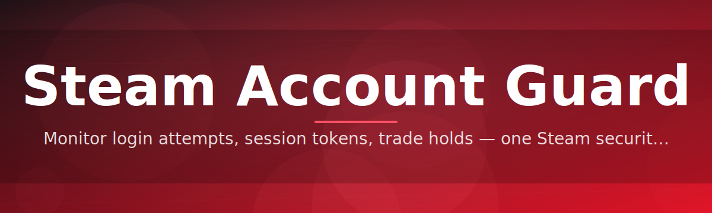
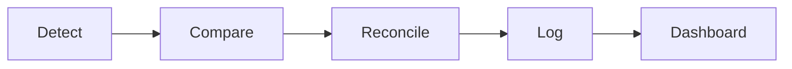

# steam-account-guard-manager 🛡️🔐

  

*A calm, dependable control room for your Steam Guard credentials — built for people who treat account security as infrastructure, not an afterthought.*

  

---

## 🧭 Overview

**steam-account-guard-manager** is a standalone Windows utility that gives Steam users a single, organized surface to manage Steam Guard authentication data — mobile authenticator states, recovery codes, login confirmation logs, and device trust records. Rather than juggling screenshots, sticky notes, and a phone you occasionally forget to charge, the tool centralizes the operational side of Steam Account Guard into one auditable dashboard. It was built on a simple premise: account security tooling should feel like enterprise-grade infrastructure software, not a hobby script.

The project exists because Steam Guard, while effective, is fundamentally a *distributed* system — a code generator on your phone, a session state on Valve's servers, and a login prompt on your desktop, all needing to agree with each other. When any one of those pieces drifts out of sync, users are left guessing. This manager acts as the reconciliation layer: it visualizes guard status, timestamps confirmations, and keeps a local, encrypted ledger of authentication events so you always know the *why* behind every prompt.

Who is this for? Community market traders managing high-value inventories, guild and clan officers responsible for shared team accounts, IT-minded gamers who like their security posture visible and versioned, and everyday players who simply want fewer "wait, did I actually approve that?" moments. If you treat your Steam library like an asset worth protecting, this is the console for it.

> [!NOTE]
> This project is a management and visibility layer for Steam Guard. It does not replace, override, or interfere with Valve's own authentication servers — it simply helps you *see* and *organize* what's already happening.

---

## ⚙️ What It Actually Does

<strong>Click to expand the full capability breakdown</strong>

 

- **Unified Guard Dashboard** — every linked account's Steam Guard state, last confirmation time, and device trust level shown on one screen, refreshed automatically.

- **Local Encrypted Vault** — recovery codes and authenticator backups are stored in an AES-encrypted local vault, never uploaded, never synced to a remote server.

- **Confirmation Timeline** — a scrollable, timestamped log of every guard prompt you've approved or denied, so disputed logins are never a mystery.

- **Multi-Account Switch Board** — designed for households, clans, and traders managing more than one Steam identity, with clear visual separation between profiles.

- **Drift Detection** — flags when a linked device's guard state disagrees with what the dashboard last recorded, prompting a manual re-sync before you trust it.

- **Offline-First Design** — the core interface works without a live connection; guard data syncs opportunistically when a connection is available.

- **Session Health Score** — a simple numeric indicator summarizing how "clean" your current account security posture looks, based on recent guard activity.

- **Export & Audit Trail** — generate a local report of guard events for personal recordkeeping or clan-level accountability.

> [!TIP]
> Enable **Session Health Score** notifications from the settings panel if you manage more than three accounts — it's the fastest way to spot an anomaly before it becomes a problem.

---

## 🚀 Get Started in Three Steps

1. Visit the landing page via the **DOWNLOAD** button above or below.

2. Download the latest standalone build for Windows — no installer wizard required.

3. Run the executable, link the Steam accounts you want to monitor, and let the dashboard populate.

4. *(Optional)* Configure your vault passphrase and enable auto-refresh for continuous guard monitoring.

---

## 🖥️ System Requirements

| Component      | Minimum                          | Recommended                     |
|-----------------|-----------------------------------|----------------------------------|
| OS              | Windows 10 (64-bit)               | Windows 11 (64-bit)              |
| Memory          | 2 GB RAM                          | 4 GB RAM                         |
| Storage         | 150 MB free                       | 300 MB free                      |
| Dependencies    | None — fully standalone           | None — fully standalone          |
| Network         | Optional, for guard sync          | Stable connection recommended    |

> [!IMPORTANT]
> No external runtimes, frameworks, or background services are required. The application is self-contained by design, which keeps its footprint small and its behavior predictable.

---

## 🔄 How It Works

The manager follows a straightforward reconciliation loop between what your device reports, what Steam's guard system expects, and what you actually approved.

1. **Detect** — the app scans linked account profiles for current guard state.
2. **Compare** — local vault records are checked against the latest confirmation timeline.
3. **Reconcile** — any drift is flagged and surfaced on the dashboard.
4. **Log** — the event, whether clean or flagged, is written to the encrypted audit trail.
5. **Present** — the Session Health Score and timeline update in real time.

---

## 🧩 Troubleshooting

<strong>My Session Health Score dropped suddenly — what happened?</strong>

 

This usually means a confirmation was logged from a device or IP the manager hasn't seen recently. Check the Confirmation Timeline for the exact event and verify it was you.

<strong>The dashboard shows "drift detected" — is my account compromised?</strong>

 

Not necessarily. Drift simply means the local vault's last known guard state doesn't match the current one. Re-sync the account manually; if the mismatch persists after re-sync, review recent login activity directly on Steam.

<strong>Can I use this without an internet connection?</strong>

 

Yes. The dashboard, vault, and audit log all function offline. Guard state simply won't refresh until a connection is available again.

<strong>Where is my vault data stored?</strong>

 

Locally, in an encrypted file on your machine. Nothing is transmitted to any external server — the vault passphrase never leaves your device.

<strong>I forgot my vault passphrase — can it be recovered?</strong>

 

No. By design, the passphrase is not recoverable, since the vault is encrypted client-side with no backdoor. This is intentional to preserve genuine local security.

> [!WARNING]
> If you lose your vault passphrase, the recovery codes and confirmation history stored locally cannot be decrypted. Always keep a secondary backup of critical recovery codes in a separate secure location.

---

## 🎨 UI / UX Details

<strong>Keyboard shortcuts</strong>

 

| Shortcut         | Action                          |
|-------------------|----------------------------------|
| `Ctrl + R`        | Force refresh guard state       |
| `Ctrl + L`        | Open confirmation timeline      |
| `Ctrl + Shift + V`| Open encrypted vault             |
| `Ctrl + K`        | Quick account switcher          |
| `Esc`             | Return to main dashboard        |

<strong>Themes and personalization</strong>

 

- **Steam Dusk** — dark theme matching Steam's native palette.
- **Enterprise Light** — high-contrast light theme for daytime dashboard use.
- **Minimal Mono** — grayscale, distraction-free layout for focused audit review.

Settings persist locally per user profile and can be reset from the settings panel at any time.

  

---

## 🤝 Contributing & Community

We welcome issues, feature discussions, and pull requests from the community. This project thrives on real-world feedback from traders, clan managers, and everyday Steam users navigating account security day to day.

> [!TIP]
> Before opening a pull request, check the open issues board — many enhancement ideas are already tagged and scoped for contributors.

- Open an issue for bugs or feature requests.
- Fork the repository and submit a pull request with a clear description of the change.
- Join discussions to help shape the roadmap for future guard-management features.

---

## 📄 License

This project is released under the [MIT License](LICENSE), 2026.

---

## ⚖️ Disclaimer

steam-account-guard-manager is an independent, community-built tool and is not affiliated with, endorsed by, or officially connected to Valve Corporation or Steam. Steam Guard and Steam are trademarks of Valve Corporation. This tool is provided for personal account organization and visibility purposes only, and users are responsible for safeguarding their own credentials and vault passphrases.

